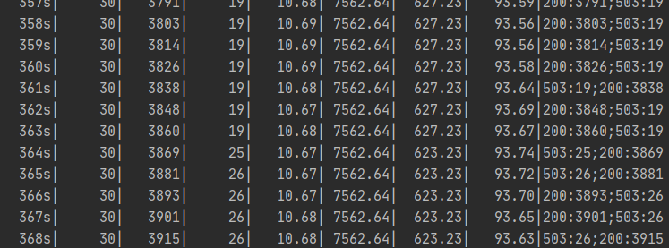
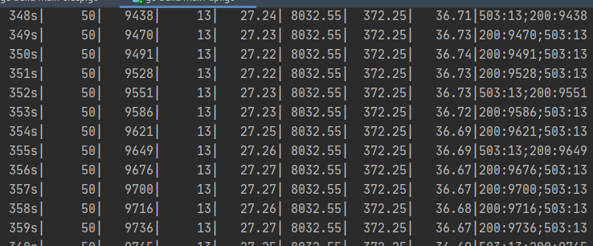
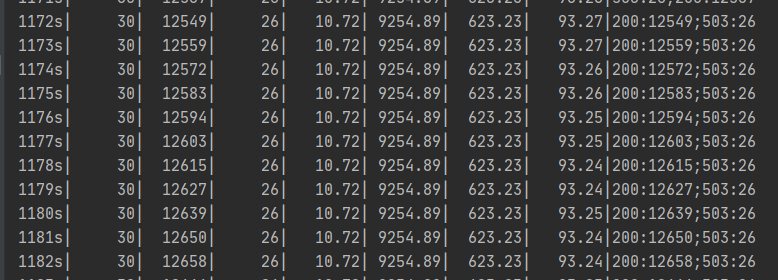
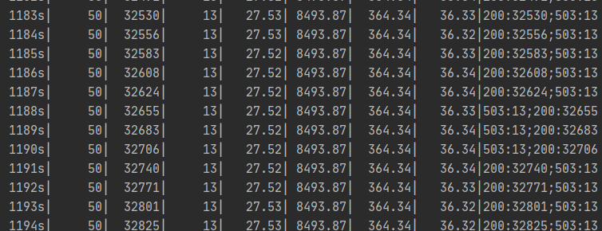

# 一 升级与回滚
1. 首先需要创建一个[Deployment](./gunicorn/flask-deployment-v1.yaml)的资源(控制着Replicaset->多个pod)
    - 解释一下deployment->replicaSet->Pod 的关系： 
        - 
        - replicaSet名称包含了其pod模板的哈希值，deployment会创建多个replicaSet用来对应管理一个版本的pod模板。
        - 使用pod模板的哈希值，让Deployment始终对给定版本的pod模板创建相同的ReplicaSet
    ```shell script
    # --record 会记录历史版本号，在之后的操作中非常有用
    kubectl create -f flask-deployment-all.yaml --record
    # 查看--record的效果,带--record参数会在CHANGE-CAUSE参数显示升级的image变化
    kubectl rollout history deployment flask-deployment -n flask-cluster
       
    # 查看详细信息
    kubectl describe  deployment flask-deployment -n flask-cluster
    
    # 查看部署状态
    kubectl rollout status deployment flask-deployment -n flask-cluster
    ```
2. **升级**
    - RollingUpdate(默认)：逐个创建，杀死pod，完成滚动升级
        - minReadySeocnds:10  可以减缓滚动升级的速度
        ```shell script
        # 修改模板内的镜像触发滚动升级，也可直接修改yaml apply 部署
        kubectl set image deployment flask-deployment flask=88382078/flask-v1.0:1.0.0
        ```
    - Recreate：一次性删除所有旧版本pod，然后创建新的pod
3. **回滚**
    - _手动命令_：若处于滚动升级过程，该命令直接停止升级删除创建的新pod，并被老版本pod替代
    ```shell script
     # 查看版本历史
    kubectl rollout history deployment flask-deployment 
   
    # 迅速回滚到上一个版本
    kubectl rollout undo deployment flask-deployment
     
    # 回滚到特定的版本
    kubectl rollout undo deployment flask-deployment --to-revision=2  
   ```
    - 
4. 升级与回滚原理：每次deployment会保存ReplicaSet集合，对应着Revision <版本号> , 那么deployment就可以方便回滚到特定的版本

# 二 控制滚动升级速率
滚动升级策略的maxSurge 和 maxUnavailable 属性，决定了一次替换多少个pod

- 假设有3个实例，使用了maxSurge=1和 maxUnavailable=0,那么就必须有3个pod一直处于可运行状态，最多允许同时存在4个pod
- 假设有3个实例，maxSurge=1 ， maxUnavailable=1，必须有2个pod一直处于可运行状态，最多同时允许4个pod，**增加了滚动升级的速度**。

# 三 滚动升级的暂停与恢复
1. 通过暂停与恢复，让新发布的服务只有少数用户访问到，验证新版本是否正常工作之后，可以将剩余的pod继续升级或者回滚到上一个的版本
    ```shell script
    # 暂停回滚
    kubectl rollout pause deployment deployment flask-deployment -n flask-cluster
    # 恢复回滚
    kubectl rollout resume deployment deployment flask-deployment -n flask-cluster
    ```

2. minReadySeconds避免部署出错版本的应用，指定新创建的pod至少要成功运行多久之后，才能将其视为可用
    - 如果一个新的pod运行出错，并且在minReadySeconds时间内它的就绪探针出现失败，那么新版本的滚动升级将被阻止
    - 通过让Kubernetes在pod就绪之后继续等待minReadySeconds的时间，然后继续执行滚动升级，来减缓滚动升级的过程
    - 通常需要将minReadySeconds设置为更高的值，确保pod在它们真正开始接受实际流量之后可以持续保持就绪状态
    - 像一种安全气囊，

# 四 产生宕机原理解析
## 4.1 从旧的 Pod 实例到新的实例究竟会发生什么?
1. **在集群内部**：
如果我们执行测试的客户端直接从集群内部连接到 flask 这个 Service，那么首先会通过 集群的 DNS 服务解析到 Service 的 ClusterIP
然后转发到 Service 后面的 Pod 实例 , 这是每个节点上面的 kube-proxy 通过更新 iptables 规则来实现的。

Kubernetes 会根据 Pods 的状态去更新 Endpoints 对象，这样就可以保证 Endpoints 中包含的都是准备好处理请求的 Pod
2. **Kubernete Ingress**:
大部分 Ingress Controller，比如 nginx-ingress、traefik 都是通过**直接 watch Endpoints 对象来直接获取 Pod 的地址的**，而不用通过 iptables 做一层转发了。

    - 一旦新的 Pod 处于活动状态并准备就绪后，Kubernetes 就将会停止旧的 Pod，从而将 Pod 的状态更新为 “Terminating”，然后从 Endpoints 对象中移除，并且发送一个 `SIGTERM` 信号给 Pod 的主进程。
    - `SIGTERM` 信号就会让容器以正常的方式关闭，并且不接受任何新的连接
    - Pod 从 Endpoints 对象中被移除后，前面的负载均衡器就会将流量路由到其他（新的）Pod 中去

# 五 存活性探测和就绪性探测
## 5.1 存活性探测
存活性探测，最主要是用来探测pod是否需要重启–决定把pod删除重新创建

在spec的containers增加与image同级
1. exec
```yaml
        livenessProbe:
          exec:
            command:
            - cat
            - /tmp/healthy
          initialDelaySeconds: 5
          periodSeconds: 10
          timeoutSeconds: 2       
          failureThreshold: 3     
```
2. http
```yaml
    livenessProbe:
      httpGet:
        path: /health
        port: 8080
        scheme: HTTP
    initialDelaySeconds: 5  #表示容器启动之后延迟多久进行liveness探测
    periodSeconds: 10       # 探测的周期时间
    timeoutSeconds: 2       # 每次执行探测的超时时间
    successThreshold: 1     # 最少连续几次探测成功的次数，满足该次数则认为success。
    failureThreshold: 3     # 最少连续几次探测失败的次数，满足该次数则认为fail作
```
3. tcp
```yaml
  livenessProbe:
      tcpSocket:
        port: 8080
  initialDelaySeconds: 5
  periodSeconds: 10
  timeoutSeconds: 2 
  failureThreshold: 3
```
## 5.2 就绪性探测
就绪性探测，用来探测pod是否已经能够提供服务–决定是否参与分配流量

在spec的containers中增加
与image同级
1. 1
```yaml
        readinessProbe:
          tcpSocket:              #任何大于200小于400的返回码都会认定是成功的返回码。其他返回码都会被认为是失败的返回码
            port: 80              #探针检测命令是检查tcp连接 端口80 是否畅通,也可以检查某个http 请求是否返回成功码
          initialDelaySeconds: 5  #告诉kubelet在第一次执行probe之前要的等待5秒钟
          periodSeconds: 10       #规定kubelet要每隔10秒执行一次readinessProbe 检查
```
2. 2
```yaml
        readinessProbe:
          httpGet:
            path: /api/nowater/version
            port: 8080
            httpHeaders:
            - name : X-Custom-Header
              value: Awesome
          initialDelaySeconds: 5
          periodSeconds: 10
```
# 六 preStop
可读探针只是我们平滑滚动更新的起点,为了解决 Pod 停止的时候不会阻塞并等到负载均衡器重新配置的问题,我们需要使用 preStop 这个生命周期的钩子，在容器终止之前调用该钩子。

生命周期钩子函数是同步的，所以必须在将最终终止信号发送到容器之前完成，在我们的示例中，我们使用该钩子简单的等待，然后 SIGTERM 信号将停止应用程序进程。同时，Kubernetes 将从 Endpoints 对象中删除该 Pod，所以该 Pod 将会从我们的负载均衡器中排除.

**基本上来说我们的生命周期钩子函数等待的时间可以确保在应用程序停止之前重新配置负载均衡器**。
```yaml
        livenessProbe:
          # ...
        readinessProbe:
          # ...
        lifecycle:
          preStop:
            exec:
              command: ["/bin/bash", "-c", "sleep 20"]
```
我们这里使用 preStop 设置了一个 20s 的宽限期，**Pod 在真正销毁前会先 sleep 等待 20s，这就相当于留了时间给 Endpoints 控制器和 kube-proxy 更新去 Endpoints 对象和转发规则，这段时间 Pod 虽然处于 Terminating 状态，即便在转发规则更新完全之前有请求被转发到这个 Terminating 的 Pod，依然可以被正常处理，因为它还在 sleep，没有被真正销毁**。

## 思考
而且上面的方式是只适用于短连接的，对于类似于 websocket 这种长连接应用需要做滚动更新的话目前还没有找到一个很好的解决方案，有的团队是将长连接转换成短连接来进行处理的，我这边还是在应用层面来做的支持，比如客户端增加重试机制，连接断掉以后会自动重新连接，大家如果有更好的办法也可以留言互相讨论下方案。

# 测试部署情况
## 部署
```shell script
vim flask-deployment-v1.txt
vim flask-deployment-v2.txt
vim flask-deployment-v3.txt
vim flask-deployment-v4.txt
vim flask-deployment-v5.txt
vim flask-deployment-v6.txt
vim flask-deployment-v7.txt
mv flask-deployment-v1.txt flask-deployment-v1.yaml
mv flask-deployment-v2.txt flask-deployment-v2.yaml
mv flask-deployment-v3.txt flask-deployment-v3.yaml
mv flask-deployment-v4.txt flask-deployment-v4.yaml
mv flask-deployment-v5.txt flask-deployment-v5.yaml
mv flask-deployment-v6.txt flask-deployment-v6.yaml
mv flask-deployment-v7.txt flask-deployment-v7.yaml
kubectl apply -f flask-deployment-v1.yaml --record
kubectl apply -f flask-deployment-v2.yaml --record
kubectl apply -f flask-deployment-v3.yaml --record
kubectl apply -f flask-deployment-v4.yaml --record
kubectl apply -f flask-deployment-v5.yaml --record
kubectl apply -f flask-deployment-v6.yaml --record
kubectl apply -f flask-deployment-v7.yaml --record
kubectl delete -f flask-deployment-v1.yaml 
kubectl delete -f flask-deployment-v2.yaml 
kubectl delete -f flask-deployment-v3.yaml 
kubectl delete -f flask-deployment-v4.yaml 
kubectl delete -f flask-deployment-v5.yaml 
```
## 更新回滚状态查询
```shell script
kubectl rollout status deployment flask-deployment 
kubectl rollout history deployment flask-deployment
kubectl rollout undo deployment flask-deployment --to-revision=2
```
## 测试用例
```shell script
curl http://10.206.67.47:30007/api/
while :; do curl http://10.206.67.47:30007/api/; sleep 1; done
# 在Fortio的示例中，每秒具有500个请求和50个并发的keep-alive连接的调用如下所示
fortio load -a -c 8 -qps 500 -t 60s http://dev-bmonitoring-nabu.qa.cloudedge.trendmicro.com/api/sleep
fortio load -a -c 8 -qps 500 -t 60s http://dev-bmonitoring-nabu.qa.cloudedge.trendmicro.com/api

# ab
ab -n 100 -c 10 http://dev-bmonitoring-nabu.qa.cloudedge.trendmicro.com/api/

# go-test
go run .\main.go -c 25 -n 100000 -u http://dev-bmonitoring-nabu.qa.cloudedge.trendmicro.com/api/
```

## 测试结果
1. rolling update 期间会随机遇到很多问题
    - rolling update：
    - 遇到504,404错误状态码，7分钟左右恢复：
    - 遇到509错误状体码，1分钟左右恢复：
2. 部署两种类型的探针
    - 发现依然存在问题:且在处理逻辑长的API，依然会有一些503出现 
    - sleep_api:
        
    - api:
        
3. 增加preStop声明钩子后，版本切换不会有问题
    - sleep_api:
        
    - api:
        