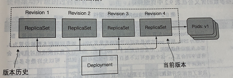
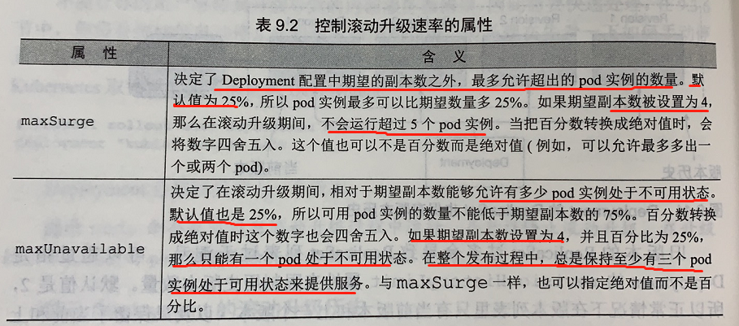
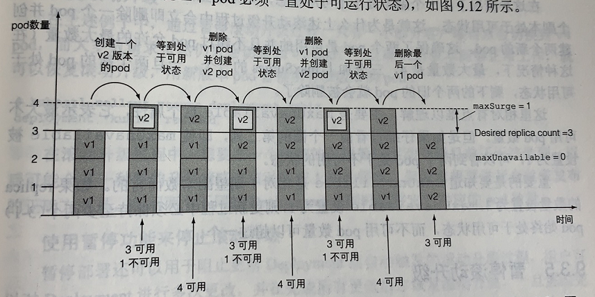
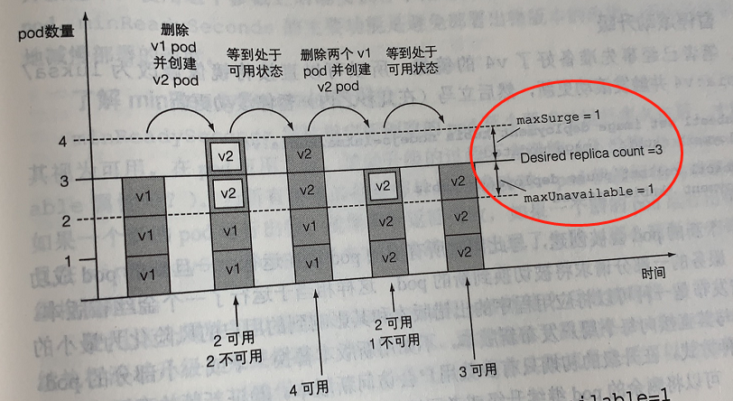
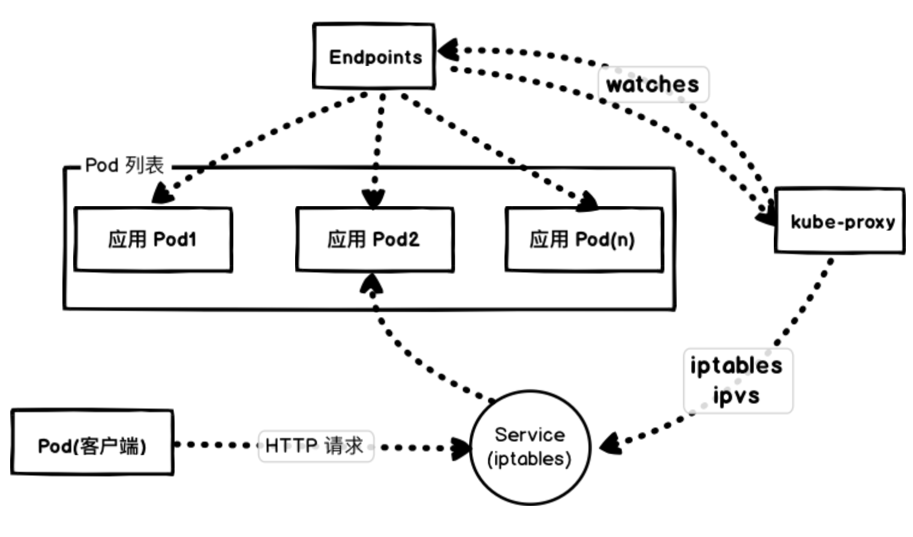
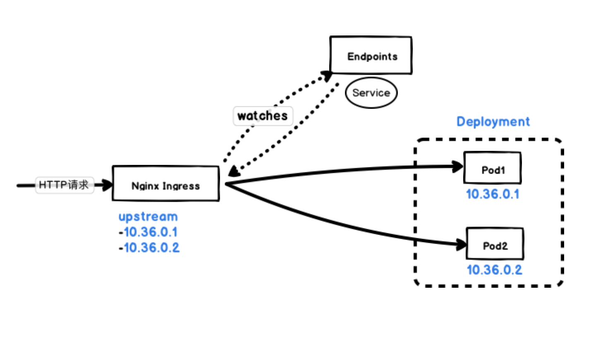
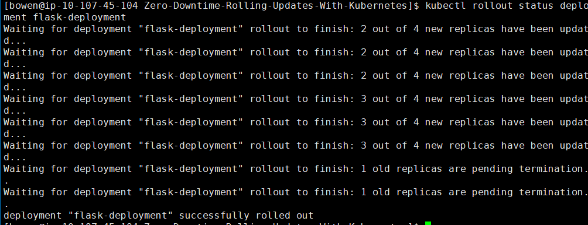
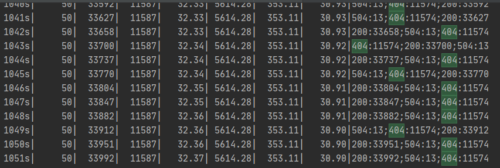
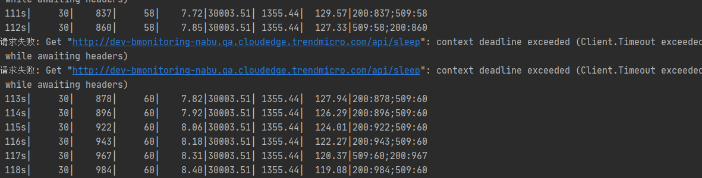

# 一 升级与回滚
1. 首先需要创建一个[Deployment](v1/flask-deployment-v1.yaml)的资源(控制着Replicaset->多个pod)
    - 解释一下deployment->replicaSet->Pod 的关系： 
        - 
        - replicaSet名称包含了其pod模板的哈希值，deployment会创建多个replicaSet用来对应管理一个版本的pod模板。
        - 使用pod模板的哈希值，让Deployment始终对给定版本的pod模板创建相同的ReplicaSet
    ```shell script
    # --record 会记录历史版本号，在之后的操作中非常有用
    kubectl create -f flask-deployment-all.yaml --record
    # 查看--record的效果,带--record参数会在CHANGE-CAUSE参数显示升级的image变化
    kubectl rollout history deployment flask-deployment -n flask-cluster
       
    # 查看详细信息
    kubectl describe  deployment flask-deployment -n flask-cluster
    
    # 查看部署状态
    kubectl rollout status deployment flask-deployment -n flask-cluster
    ```
2. **升级**
    - RollingUpdate(默认)：逐个创建，杀死pod，完成滚动升级
        - minReadySeocnds:10  可以减缓滚动升级的速度
        ```shell script
        # 修改模板内的镜像触发滚动升级，也可直接修改yaml apply 部署
        kubectl set image deployment flask-deployment flask=88382078/flask-v1.0:1.0.0
        ```
    - Recreate：一次性删除所有旧版本pod，然后创建新的pod
3. **回滚**
    - _手动命令_：若处于滚动升级过程，该命令直接停止升级删除创建的新pod，并被老版本pod替代
    ```shell script
     # 查看版本历史
    kubectl rollout history deployment flask-deployment 
   
    # 迅速回滚到上一个版本
    kubectl rollout undo deployment flask-deployment
     
    # 回滚到特定的版本
    kubectl rollout undo deployment flask-deployment --to-revision=2  
   ```
    - 
4. 升级与回滚原理：每次deployment会保存ReplicaSet集合，对应着Revision <版本号> , 那么deployment就可以方便回滚到特定的版本

# 二 控制滚动升级速率
滚动升级策略的maxSurge 和 maxUnavailable 属性，决定了一次替换多少个pod

- 假设有3个实例，使用了maxSurge=1和 maxUnavailable=0,那么就必须有3个pod一直处于可运行状态，最多允许同时存在4个pod
- 假设有3个实例，maxSurge=1 ， maxUnavailable=1，必须有2个pod一直处于可运行状态，最多同时允许4个pod，**增加了滚动升级的速度**。

# 三 滚动升级的暂停与恢复
1. 通过暂停与恢复，让新发布的服务只有少数用户访问到，验证新版本是否正常工作之后，可以将剩余的pod继续升级或者回滚到上一个的版本
    ```shell script
    # 暂停回滚
    kubectl rollout pause deployment deployment flask-deployment -n flask-cluster
    # 恢复回滚
    kubectl rollout resume deployment deployment flask-deployment -n flask-cluster
    ```

2. minReadySeconds避免部署出错版本的应用，指定新创建的pod至少要成功运行多久之后，才能将其视为可用
    - 如果一个新的pod运行出错，并且在minReadySeconds时间内它的就绪探针出现失败，那么新版本的滚动升级将被阻止
    - 通过让Kubernetes在pod就绪之后继续等待minReadySeconds的时间，然后继续执行滚动升级，来减缓滚动升级的过程
    - 通常需要将minReadySeconds设置为更高的值，确保pod在它们真正开始接受实际流量之后可以持续保持就绪状态
    - 像一种安全气囊，

# 四 产生宕机原理解析
## 4.1 从旧的 Pod 实例到新的实例究竟会发生什么?
1. **在集群内部**：
如果我们执行测试的客户端直接从集群内部连接到 flask 这个 Service，那么首先会通过 集群的 DNS 服务解析到 Service 的 ClusterIP
然后转发到 Service 后面的 Pod 实例 , 这是每个节点上面的 kube-proxy 通过更新 iptables 规则来实现的。

Kubernetes 会根据 Pods 的状态去更新 Endpoints 对象，这样就可以保证 Endpoints 中包含的都是准备好处理请求的 Pod
2. **Kubernete Ingress**:
大部分 Ingress Controller，比如 nginx-ingress、traefik 都是通过**直接 watch Endpoints 对象来直接获取 Pod 的地址的**，而不用通过 iptables 做一层转发了。

    - 一旦新的 Pod 处于活动状态并准备就绪后，Kubernetes 就将会停止旧的 Pod，从而将 Pod 的状态更新为 “Terminating”，然后从 Endpoints 对象中移除，并且发送一个 `SIGTERM` 信号给 Pod 的主进程。
    - `SIGTERM` 信号就会让容器以正常的方式关闭，并且不接受任何新的连接
    - Pod 从 Endpoints 对象中被移除后，前面的负载均衡器就会将流量路由到其他（新的）Pod 中去
# 测试部署情况
## 部署
```shell script
vim flask-deployment-v1.txt
vim flask-deployment-v2.txt
vim flask-deployment-v3.txt
vim flask-deployment-v4.txt
vim flask-deployment-v5.txt
mv flask-deployment-v1.txt flask-deployment-v1.yaml
mv flask-deployment-v2.txt flask-deployment-v2.yaml
mv flask-deployment-v1.txt flask-deployment-v3.yaml
mv flask-deployment-v1.txt flask-deployment-v4.yaml
mv flask-deployment-v1.txt flask-deployment-v5.yaml
kubectl apply -f flask-deployment-v1.yaml --record
kubectl apply -f flask-deployment-v2.yaml --record
kubectl apply -f flask-deployment-v3.yaml --record
kubectl apply -f flask-deployment-v4.yaml --record
kubectl apply -f flask-deployment-v5.yaml --record
kubectl delete -f flask-deployment-v1.yaml 
kubectl delete -f flask-deployment-v2.yaml 
kubectl delete -f flask-deployment-v3.yaml 
kubectl delete -f flask-deployment-v4.yaml 
kubectl delete -f flask-deployment-v5.yaml 
```
## 更新回滚状态查询
```shell script
kubectl rollout status deployment flask-deployment 
kubectl rollout history deployment flask-deployment
kubectl rollout undo deployment flask-deployment --to-revision=2
```
## 测试用例
```shell script
curl http://10.206.67.47:30007/api/
while :; do curl http://10.206.67.47:30007/api/; sleep 1; done
# 在Fortio的示例中，每秒具有500个请求和50个并发的keep-alive连接的调用如下所示
fortio load -a -c 8 -qps 500 -t 60s http://dev-bmonitoring-nabu.qa.cloudedge.trendmicro.com/api/sleep
fortio load -a -c 8 -qps 500 -t 60s http://dev-bmonitoring-nabu.qa.cloudedge.trendmicro.com/api

# ab
ab -n 100 -c 10 http://dev-bmonitoring-nabu.qa.cloudedge.trendmicro.com/api/

# go-test
go run .\main.go -c 25 -n 100000 -u http://dev-bmonitoring-nabu.qa.cloudedge.trendmicro.com/api/
```

## 测试结果
1. rolling update 期间会随机遇到很多问题
    - rolling update：
    - 遇到504,404错误状态码，7分钟左右恢复：
    - 遇到509错误状体码，1分钟左右恢复：